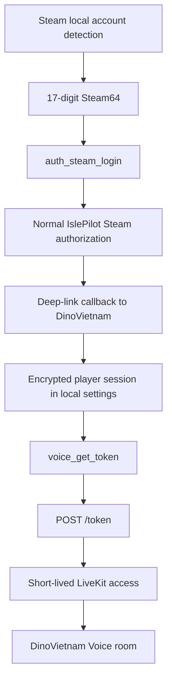

# Authentication flow

## Confirmed player lifecycle

Evidence:

- path: DinoVietNam.exe (read-only static inspection)
- component: embedded Rust strings
- symbols: `loginusers.vdf`, `Steam\\ActiveProcess`, `auth_steam_login`,
  `/oauth/start?steam=`, `Applied Steam deep-link auth`, `VOICE_NOT_AUTHED`
- finding: local Steam64 discovery starts a normal web authorization; a
  deep-link callback establishes the player session before Voice access.

Evidence:

- path: `%LOCALAPPDATA%\\dinovietnam-hud\\settings.json`
- component: `overlayTokenEnc`
- finding: the official app persists its authorized player session encrypted.
  No credential value was read, printed or copied into this project.

## Voice token exchange

- Method: `POST`.
- Path: `/token`.
- Public discovery: `GET /rooms`.
- Transport after authorization: LiveKit over the configured secure WebSocket.
- Response model: `serverId`, `token`, `identity` and `room` are present in the
  official client. Exact expiry remains **UNCONFIRMED**.

The Voice exchange has two separate authorization inputs:

1. An authenticated player session. Without it the command returns
   `VOICE_NOT_AUTHED`.
2. A private 48-byte application credential loaded from `DINOVN_VOICE_TOKEN`
   or from a compiled fallback and sent as `x-api-key`.

The credential value is intentionally recorded only as `<REDACTED>`.

Evidence:

- path: DinoVietNam.exe (read-only PE xref inspection)
- component: `src\\launcher\\voice.rs`-derived command implementation
- xref: `DINOVN_VOICE_TOKEN` at VA `0x1410544B0`, referenced by
  `0x1406E4E11`
- finding: when the environment override is absent, the function allocates
  exactly `0x30` bytes and copies three 16-byte static blocks before building
  the Voice request.

Evidence:

- path: DinoVietNam.exe (read-only PE xref inspection)
- component: HTTP request builder
- string: `x-api-key`
- xrefs: `0x14032C9CA`, `0x14070405F`
- finding: the private application credential is added as an HTTP header.

Evidence:

- component: DinoVietnam Voice `/token`
- finding: unauthenticated GET is not a route; POST requests using only the
  user's normal IslePilot player credential return HTTP 401.

## Authorization boundary

A clean independent desktop client cannot obtain Voice access from the normal
player login alone. Copying the compiled application credential would turn a
private client secret into a redistributable secret and bypass the intended
service boundary. This project does not recover, use or distribute it.
