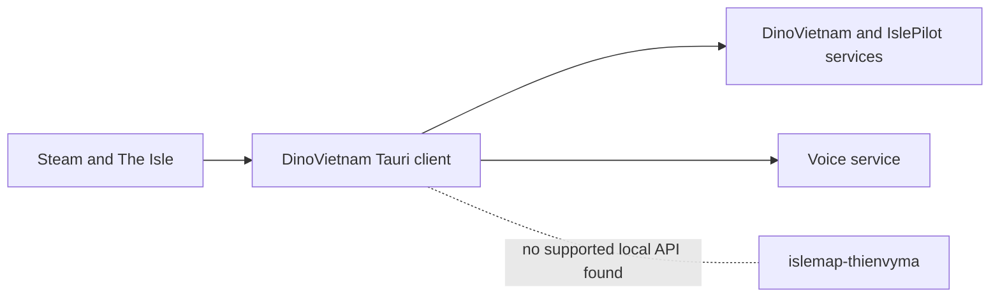

# DinoVietnam Voice discovery

## Scope

`DinoVietNam.exe` was treated as read-only. No DinoVietnam file, process
memory, server, TLS configuration or stored credential was modified. Sensitive
values are recorded only as `<REDACTED>`.

## Application inventory

The local reference executable is a Windows x64 Rust/Tauri application using
WRY and Microsoft WebView2. Its embedded source-path strings identify
`src\\launcher\\voice.rs`, `src\\launcher\\steam.rs`, `src\\steam\\local.rs`,
`src\\api\\client.rs`, `src\\overlay.rs`, `src\\protocol.rs` and
`src\\settings.rs`.

Evidence:

- path: `C:\Users\thien\OneDrive\Máy tính\DinoVietNam.exe`
- component: PE executable and embedded Rust strings
- symbols: `voice_get_token`, `voice_set_ptt_vk`, `auth_steam_login`,
  `detect_steam_id_cmd`
- finding: authentication, Voice-token exchange and global PTT are native
  Tauri commands; audio runs in a WebView route.

Evidence:

- path: `%LOCALAPPDATA%\com.dinovietnam.hud\EBWebView\Default\Code Cache\js`
- component: cached production JavaScript
- finding: `/voicemic`, `$voiceState`, `$voiceRoomName`, room participants,
  `whisper`, `full`, `shout`, `pttVk`, `micId`, `speakerId` and `gate` are
  present.

Evidence:

- path: `%LOCALAPPDATA%\dinovietnam-hud\settings.json`
- component: native settings
- finding: Steam/player identity and an encrypted overlay session are present.
  The encrypted value was not read, decrypted or copied.

## Local interoperability search

The running reference client had outbound HTTP/TLS connections and local UDP
sockets used by realtime media. It exposed no listening localhost TCP endpoint.
Static searches found Tauri's own WebView IPC and internal named-pipe/runtime
strings, but no documented local HTTP, WebSocket, named-pipe or command-line
control API for another application.

This rules out an authentication bridge unless DinoVietnam later publishes a
local API. Tauri invoke messages are scoped to the official WebView and are not
a supported cross-process interface.
