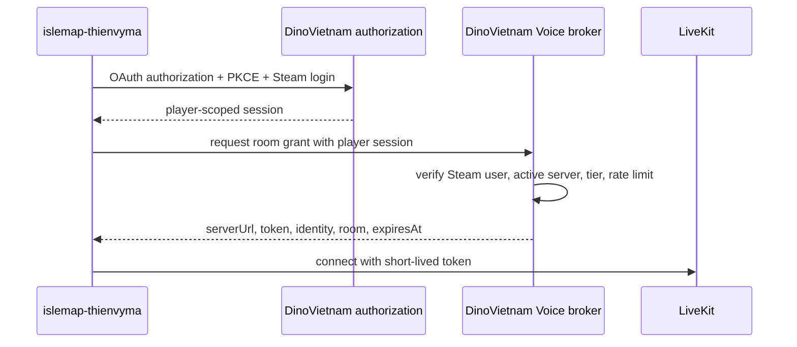

# Integration decision

## C — Server support is required

The player's Steam/IslePilot session is necessary but does not authorize the
DinoVietnam Voice `/token` endpoint by itself. The official desktop client also
supplies a private application credential through `x-api-key`. There is no
public OAuth client registration, player-scoped token broker or supported local
IPC that lets another clean desktop client request the same Voice grant.

The previous background-process bridge was removed because the accepted product
requirement is a clean PC with only islemap-thienvyma installed. Shipping the
official executable, depending on its files/session, or copying its credential
would violate that requirement.

The minimum supported backend contract is:

Required server work:

1. Register `islemap-thienvyma` as a public OAuth client and support PKCE plus
   a documented callback URI.
2. Accept the resulting player-scoped session at a Voice token broker.
3. Validate the Steam identity, current DinoVietnam server, allowed room/tier,
   nonce/state and rate limits on the server.
4. Return a short-lived response containing `serverUrl`, `token`, `identity`,
   `room` and `expiresAt`, with refresh/revocation behavior documented.
5. Keep all service credentials on the server; never embed a reusable secret
   in either desktop application.

Until DinoVietnam exposes this contract, the Hub cannot ship an independent
DinoVietnam Voice runtime. Version 2.4.1 provides a companion tab instead: it
detects an installed official client and whether that client has a Steam
session, then launches the original Voice flow. The official client remains
the process that obtains the room grant and runs LiveKit.
