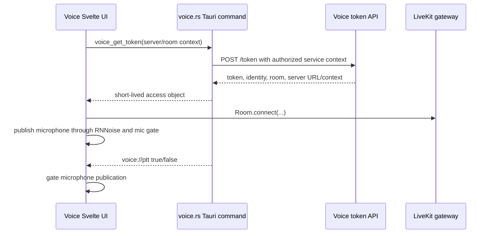

# Voice stack

## Confirmed technology

The Voice transport is LiveKit/WebRTC.

Evidence:

- path: `%LOCALAPPDATA%\com.dinovietnam.hud\EBWebView\Default\Code Cache\js\45450873d1dea632_0`
- component: cached Voice JavaScript dependency
- symbols: `Room`, `RoomEvent`, `LocalParticipant`,
  `LocalTrackPublication`, `RemoteAudioTrack`, `setMicrophoneEnabled`,
  `livekit.TrackSource`, `livekit.DisconnectReason`
- finding: the frontend contains the LiveKit client and protocol types.

Evidence:

- path: `%LOCALAPPDATA%\com.dinovietnam.hud\EBWebView\Default\Code Cache\js\e1455edfc44e9e77_0`
- component: DinoVietnam Voice UI
- symbols: `@sapphi-red/web-noise-suppressor/rnnoise`,
  `/voice/mic-gate.worklet.js`, `dvn-mic-chain`, `setMicrophoneEnabled`
- finding: microphone capture and incoming audio are implemented in WebView
  JavaScript. Rust supplies authorization and global-key state.

## Runtime model

The client exposes room counts from `GET /rooms`. Room identifiers use a
`dvn-` namespace and production UI data includes VIP, Premium and Ultra tiers.
The official client remains responsible for selecting the tier that matches
the active DinoVietnam game server.

## Error and reconnect evidence

The production UI handles `VOICE_NOT_AUTHED`, `VOICE_DUPLICATE`,
`VOICE_KICKED`, `VOICE_SERVER_DOWN`, microphone-denied and microphone-missing
states. LiveKit's default reconnect policy and duplicate-identity reason are
present in the client dependency. Exact token TTL is **UNCONFIRMED** because it
is neither published by the room endpoint nor safely observable without an
authorized token response.
